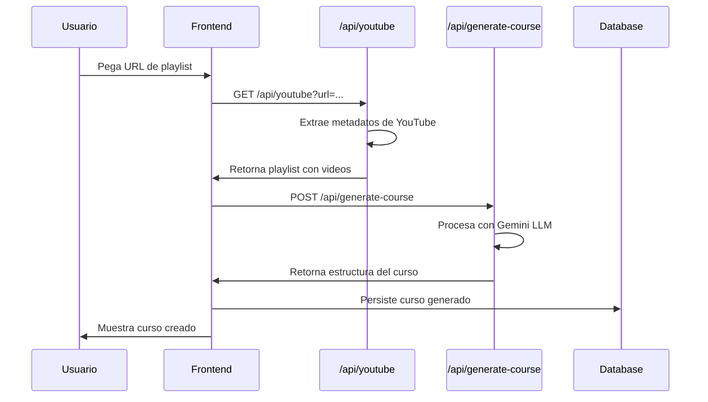
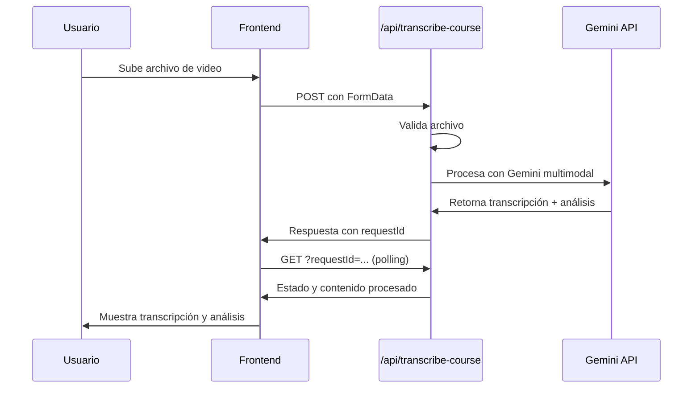

# Guía de Integración Backend - PrioSync LLM Features

## Resumen Ejecutivo

Este documento describe la implementación completa de las funcionalidades de **Inteligencia Artificial (LLM)** en PrioSync, incluyendo:

- **Transcripción automática de videos** con Google Gemini 2.5 Flash
- **Estructuración inteligente de cursos** desde playlists de YouTube
- **Integración completa YouTube → Gemini → Backend**

---

## Arquitectura General

### Stack Tecnológico
- **Framework**: Next.js 15.5.2 con App Router
- **Runtime**: Node.js Edge Runtime
- **LLM Provider**: Google Gemini (gemini-2.5-flash-lite & gemini-2.0-flash-exp)
- **API Externa**: YouTube Data API v3
- **Validación**: Zod Schemas
- **Seguridad**: Input sanitization + prompt injection protection

### Flujo de Datos
```
Frontend → Next.js API Routes → LLM Processing → Database Storage → Frontend Response
    ↓              ↓                  ↓              ↓                    ↓
1. Upload      2. Validation     3. AI Analysis   4. Persistence    5. User Display
```

---

## APIs Implementadas

### 1. `/api/youtube` - Importación de Playlists

**Propósito**: Extraer metadatos completos de playlists de YouTube

#### **GET** `/api/youtube?url={youtube_playlist_url}`

**Parámetros de Query:**
- `url` (string, requerido): URL completa de playlist de YouTube

**Respuesta Exitosa (200):**
```json
{
  "success": true,
  "data": {
    "id": "PLrAFSMZlUClnOPnzag6vXKUtlH7HKAVGe",
    "title": "Curso Completo de React",
    "description": "Aprende React desde cero...",
    "thumbnailUrl": "https://i.ytimg.com/vi/...",
    "channelTitle": "Fazt Code",
    "channelId": "UCMn28O1sQGochG94HdlthbA",
    "publishedAt": "2023-01-15T10:00:00Z",
    "itemCount": 25,
    "videos": [
      {
        "id": "T_7XYnos9kA",
        "title": "Introducción a React",
        "description": "En esta clase veremos...",
        "duration": "12:45",
        "thumbnailUrl": "https://i.ytimg.com/vi/...",
        "publishedAt": "2023-01-15T10:00:00Z",
        "viewCount": 45000,
        "position": 0
      }
    ]
  }
}
```

**Errores Comunes:**
- `400`: URL de playlist inválida
- `500`: Error al consultar YouTube API
- `503`: Límite de cuota de YouTube API alcanzado

**Dependencias:**
- Variables de entorno: `YOUTUBE_API_KEY`
- Tipos: `YouTubePlaylist`, `YouTubeVideo`

---

### 2. `/api/generate-course` - Generación Inteligente de Estructura

**Propósito**: Convertir playlist de YouTube en estructura de curso educativo usando LLM

#### **POST** `/api/generate-course`

**Body (JSON):**
```json
{
  "playlist": {
    "id": "PLrAFSMZlUClnOPnzag6vXKUtlH7HKAVGe",
    "title": "Curso Completo de React",
    "videos": [
      {
        "id": "T_7XYnos9kA",
        "title": "Introducción a React",
        "duration": "12:45",
        "description": "En esta clase..."
      }
    ]
  },
  "customization": {
    "title": "React Fundamentals Pro",
    "level": "intermediate",
    "category": "Frontend Development",
    "instructor": "Instructor personalizado"
  }
}
```

**Respuesta Exitosa (200):**
```json
{
  "success": true,
  "data": {
    "title": "React Fundamentals Pro",
    "description": "Curso completo de React JS que cubre desde conceptos básicos hasta patrones avanzados...",
    "category": "Frontend Development",
    "level": "intermediate",
    "estimatedDuration": "5h 30m",
    "instructor": "Fazt Code",
    "objectives": [
      "Dominar los fundamentos de React",
      "Implementar componentes reutilizables",
      "Manejar estado con hooks"
    ],
    "modules": [
      {
        "id": "modulo-1",
        "title": "Fundamentos de React",
        "description": "Conceptos básicos y configuración inicial",
        "order": 1,
        "estimatedDuration": "2h 15m",
        "lessons": [
          {
            "id": "leccion-1",
            "title": "Introducción a React",
            "description": "Qué es React y por qué usarlo",
            "order": 1,
            "youtubeVideoId": "T_7XYnos9kA",
            "duration": "12:45",
            "objectives": [
              "Entender qué es React",
              "Conocer las ventajas de React"
            ],
            "keyTopics": [
              "Virtual DOM",
              "Componentes",
              "JSX"
            ]
          }
        ]
      }
    ],
    "tags": ["react", "javascript", "frontend"],
    "prerequisites": ["Conocimientos básicos de JavaScript"],
    "targetAudience": "Desarrolladores web que quieren aprender React"
  },
  "processingTime": 3500
}
```

**Health Check**: `GET /api/generate-course?status=health`
```json
{
  "success": true,
  "status": "healthy",
  "services": {
    "geminiAI": "available"
  },
  "timestamp": "2025-10-04T15:30:00Z"
}
```

**Errores Comunes:**
- `400`: Datos de playlist inválidos o faltantes
- `503`: Servicio de IA no disponible
- `504`: Timeout de procesamiento (>90s)

**Dependencias:**
- Variables de entorno: `GOOGLE_GENERATIVE_AI_API_KEY`
- Tipos: `GeneratedCourseStructure`, `CourseCustomization`
- Utils: `@/utils/ai/courseStructureGenerator`

---

### 3. `/api/transcribe-course` - Transcripción Multimodal

**Propósito**: Transcribir videos y generar contenido educativo enriquecido

#### **POST** `/api/transcribe-course`

**Content-Type**: `multipart/form-data`

**FormData Fields:**
- `title` (string): Título del contenido
- `description` (string, opcional): Descripción adicional
- `courseId` (string): ID del curso
- `courseName` (string): Nombre del curso
- `video` (File): Archivo de video a transcribir

**Tipos de Archivo Soportados:**
- Video: `mp4`, `avi`, `mov`, `quicktime`, `wmv`, `mkv`
- Audio: `mp3`, `wav`, `ogg`
- Límite de tamaño: 100MB
- Duración máxima: 2 horas

**Respuesta Exitosa (201):**
```json
{
  "success": true,
  "requestId": "transcribe_1696435200_xyz123",
  "message": "Video transcrito y analizado exitosamente usando análisis multimedia real con Google Gemini SDK nativo",
  "videoMetadata": {
    "title": "Introducción a React Hooks",
    "description": "Video sobre useState y useEffect",
    "courseId": "react-course-01",
    "courseName": "Curso Completo de React",
    "fileName": "react-hooks-intro.mp4",
    "fileSize": 52428800,
    "fileType": "video/mp4",
    "duration": 895,
    "uploadedAt": "2025-10-04T15:30:00Z"
  }
}
```

#### **GET** `/api/transcribe-course?requestId={id}`

**Consultar Estado de Transcripción:**
```json
{
  "id": "transcribe_1696435200_xyz123",
  "requestId": "transcribe_1696435200_xyz123",
  "videoMetadata": { /* metadatos del video */ },
  "status": "completed",
  "progress": 100,
  "transcriptionText": "[TRANSCRIPCIÓN COMPLETA]\n\nBienvenidos a esta clase sobre React Hooks...",
  "enrichedContent": "# Introducción a React Hooks\n\n## Conceptos Fundamentales\n\nLos React Hooks son funciones especiales...",
  "analysis": {
    "summary": "Esta clase cubre los conceptos fundamentales de React Hooks",
    "keyTopics": ["useState", "useEffect", "Custom Hooks"],
    "difficulty": "intermediate",
    "recommendations": [
      "Practicar con ejemplos de useState",
      "Experimentar con useEffect cleanup"
    ],
    "educationalStructure": {
      "introduction": "Introducción a los conceptos de Hooks",
      "mainConcepts": ["Estado con useState", "Efectos con useEffect"],
      "examples": ["Contador con useState", "Fetching de datos"],
      "conclusion": "Los Hooks simplifican el manejo de estado en componentes funcionales"
    }
  },
  "createdAt": "2025-10-04T15:30:00Z",
  "updatedAt": "2025-10-04T15:32:15Z"
}
```

**Estados Posibles:**
- `pending`: En cola de procesamiento
- `processing`: Siendo procesado por Gemini
- `completed`: Transcripción y análisis completados
- `failed`: Error durante el procesamiento

**Errores Comunes:**
- `400`: Archivo no válido o datos faltantes
- `413`: Archivo demasiado grande (>100MB)
- `415`: Tipo de archivo no soportado
- `500`: Error durante la transcripción

**Dependencias:**
- Variables de entorno: `GOOGLE_GENERATIVE_AI_API_KEY`
- Tipos: `TranscriptionJobStatus`, `VideoMetadata`
- Configuración: `VIDEO_CONFIG` en `@/types/transcription`

---

## Configuración del Backend

### Variables de Entorno Requeridas

```env
# APIs Externas
GOOGLE_GENERATIVE_AI_API_KEY=AIzaSyC...  # Gemini API Key
YOUTUBE_API_KEY=AIzaSyD...               # YouTube Data API v3

# Configuración opcional
LANGCHAIN_VERBOSE=true                   # Debug de LangChain
NEXT_PUBLIC_VERCEL_URL=                  # URL base para producción
```

### Configuración de Runtime

```typescript
// En todos los archivos de API que usan IA
export const runtime = 'nodejs';        // Requerido para Google Gemini SDK
export const maxDuration = 300;         // 5 minutos para transcripción
```

---

## Estructura de Archivos Críticos

### APIs (/src/app/api/)
```
src/app/api/
├── youtube/route.ts              # Importación de playlists
├── generate-course/route.ts      # Generación de estructura con LLM
├── transcribe-course/route.ts    # Transcripción multimodal
├── courses/route.ts              # CRUD de cursos
└── courses/[id]/
    ├── route.ts                  # Operaciones por curso
    └── enroll/route.ts           # Inscripciones
```

### Utilidades (/src/utils/)
```
src/utils/
├── ai/
│   └── courseStructureGenerator.ts    # Lógica de generación con Gemini
├── api/
│   └── youtube.ts                     # Helpers de YouTube API
├── security-patterns.ts               # Protección contra prompt injection
└── commons/
    └── validation.ts                  # Validaciones comunes
```

### Tipos TypeScript (/src/types/)
```
src/types/
├── youtube.ts                    # Interfaces de YouTube y cursos
├── transcription.ts              # Interfaces de transcripción
├── quiz.ts                       # Interfaces de evaluaciones
└── studySession.ts               # Interfaces de sesiones de estudio
```

---

## Seguridad y Validación

### Protección contra Prompt Injection

**Implementación**: `/src/utils/security-patterns.ts`

```typescript
// Patrones peligrosos detectados
const DANGEROUS_PATTERNS = [
  /ignore\s+previous\s+instructions/i,
  /act\s+as\s+a\s+different/i,
  /pretend\s+to\s+be/i,
  /system\s*:\s*/i,
  /<\|.*?\|>/g,
  /\[INST\].*?\[\/INST\]/g
];

// Sanitización de inputs
function sanitizeTextInput(input: string, maxLength: number = 100): string {
  return input
    .replace(/[<>{}[\]]/g, '')      // Remover brackets
    .replace(/\\/g, '')             // Remover backslashes
    .replace(/["'`]/g, '')          // Remover comillas
    .replace(/\n|\r/g, ' ')         // Normalizar espacios
    .trim()
    .substring(0, maxLength);
}
```

### Validación de Archivos

```typescript
// Configuración de límites
const VIDEO_CONFIG = {
  MAX_FILE_SIZE: 100 * 1024 * 1024,     // 100MB
  ALLOWED_TYPES: [
    'video/mp4', 'video/avi', 'video/mov',
    'audio/mp3', 'audio/wav', 'audio/ogg'
  ],
  MAX_DURATION: 7200                      // 2 horas
};
```

---

## Optimizaciones de Performance

### 1. **Timeouts y Reintentos**
```typescript
const COURSE_GENERATION_CONFIG = {
  maxRetries: 3,
  retryDelay: 2000,
  timeout: 90000,
  model: 'gemini-2.5-flash-lite'
};
```

### 2. **Streaming de Respuestas**
- Las transcripciones se procesan de forma asíncrona
- El frontend consulta el estado mediante polling
- Responses inmediatas con `requestId` para tracking

### 3. **Fallback Inteligente**
- Si falla el procesamiento multimodal, se genera contenido contextual
- Estructura de curso de respaldo si falla el LLM
- Transcripciones predeterminadas para casos extremos

---

## Flujos de Integración Completos

### 1. **Flujo YouTube → Curso**



### 2. **Flujo Video → Transcripción**



---

## Testing y Debugging

### Health Checks Disponibles

1. **Gemini API**: `GET /api/generate-course?status=health`
2. **YouTube API**: Verificar `YOUTUBE_API_KEY` en logs
3. **Transcripción**: Subir video de prueba pequeño

### Logs Importantes

```typescript
// Logs críticos para debugging
console.log('Enviando archivo a Gemini con SDK nativo...');
console.log('Transcripción multimedia completada');
console.log(`Estructura generada exitosamente en ${processingTime}ms`);
```

### Errores Comunes y Soluciones

| Error | Causa | Solución |
|-------|-------|----------|
| `API key no configurada` | Falta `GOOGLE_GENERATIVE_AI_API_KEY` | Configurar variable de entorno |
| `Timeout en generación` | Respuesta LLM >90s | Reducir complejidad del prompt |
| `Quota exceeded` | Límite de YouTube API | Esperar reset o aumentar quota |
| `File too large` | Video >100MB | Comprimir video o cambiar límite |

---

## Deployment y Escalabilidad

### Consideraciones para Producción

1. **Rate Limiting**: Implementar límites por usuario/IP
2. **Cache**: Cachear respuestas de YouTube API (1 hora)
3. **Queue System**: Cola de trabajos para transcripciones largas
4. **Monitoring**: Alertas por fallos de API o timeouts
5. **Backup Models**: Configurar múltiples providers de LLM

### Escalado Horizontal

```typescript
// Configuración para múltiples instancias
const DEPLOYMENT_CONFIG = {
  maxConcurrentTranscriptions: 5,
  enableDistributedCache: true,
  fallbackProviders: ['openai', 'anthropic'],
  enableQueueSystem: true
};
```

---

## Métricas y Monitoreo

### KPIs Importantes

- **Tiempo de respuesta promedio**: <5s para generación de curso
- **Tasa de éxito**: >95% en transcripciones
- **Uso de cuota**: YouTube API y Gemini API
- **Errores por timeouts**: <2% de requests

### Logs de Auditoría

```json
{
  "timestamp": "2025-10-04T15:30:00Z",
  "endpoint": "/api/generate-course",
  "requestId": "req_xyz123",
  "processingTime": 3500,
  "model": "gemini-2.5-flash-lite",
  "success": true,
  "videoCount": 25,
  "modulesGenerated": 4
}
```

---

## Recursos Adicionales

### Documentación Externa

- [Google Gemini API Documentation](https://ai.google.dev/docs)
- [YouTube Data API v3](https://developers.google.com/youtube/v3)
- [Next.js App Router API Routes](https://nextjs.org/docs/app/building-your-application/routing/route-handlers)

### Archivos de Configuración

- `next.config.ts`: Configuración de runtime y timeout
- `vercel.json`: Configuración de deployment para Vercel
- `tsconfig.json`: Configuración TypeScript estricta